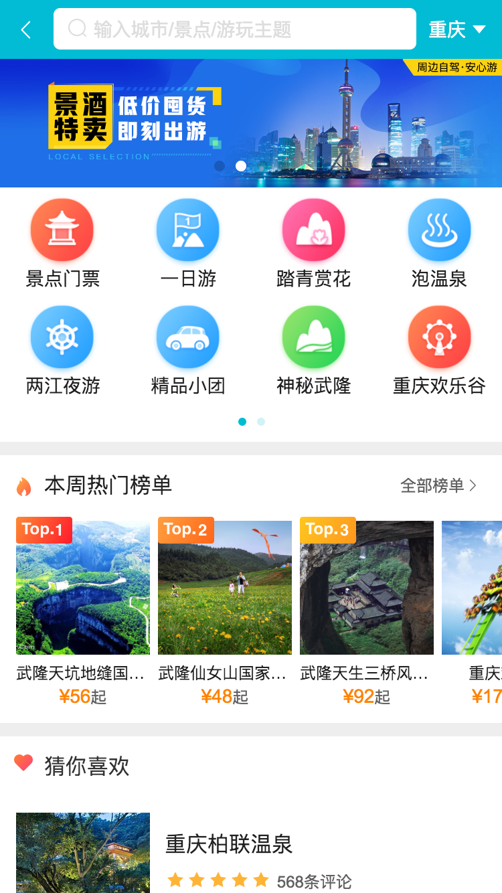
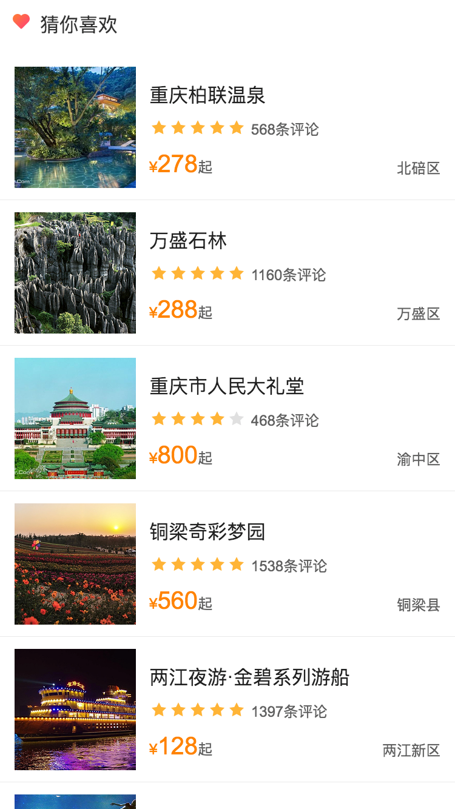
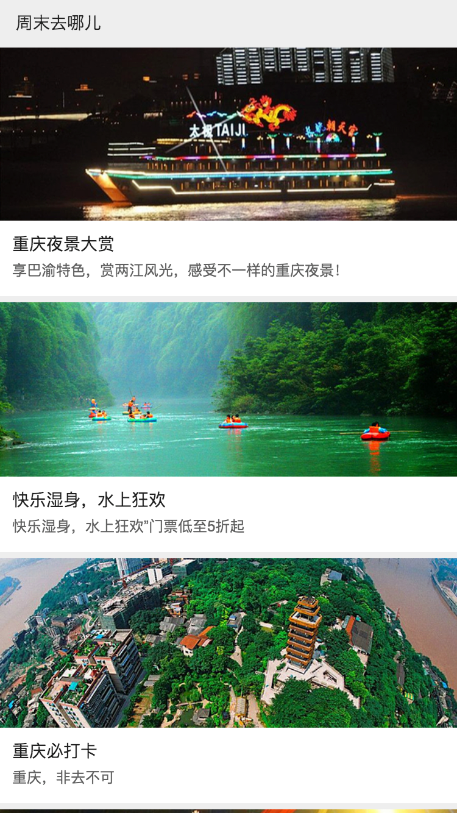

<h1 align="center">Welcome to vue-qunaer 👋</h1>
<p>
  
  
  
  <a href="#" target="_blank">
    
  </a>
</p>

> 基于vue.js仿去哪儿网

## 主要使用的库（框架）

- **Vue**: 实现MVVM设计模式
  - **Vue-CLI**: *使用脚手架快速建立基础结构*
  - **Vuex**: *全局数据共享*
  - **VueRouter**: *页面路由*
- **Axios**: 异步数据请求
- **Better-Scroll**: 更好的滚动效果

--- 

### 🏠 [Github](https://github.com/Jiangmenghao/vue-qunaer)

### ✨ [演示Demo](https://qunaer.maoxiaohei.top)

## 安装

```sh
npm install
```

## 使用

```sh
npm run start
```

## 截图




## 动态展示
### 首页


### 城市选择页


### 景点详情页


## 作者

👤 **Jiang Menghao**

* Github: [@Jiangmenghao](https://github.com/Jiangmenghao)

## Show your support

Give a ⭐️ if this project helped you!
